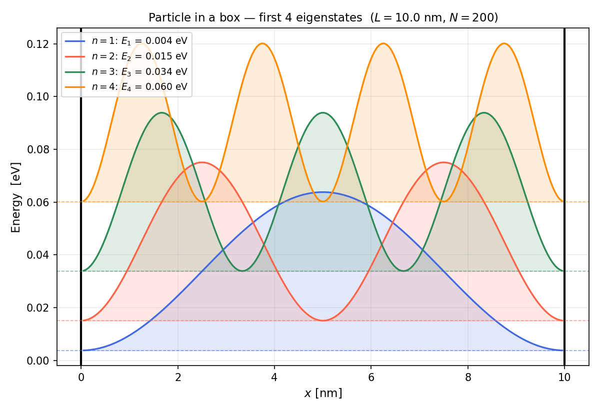
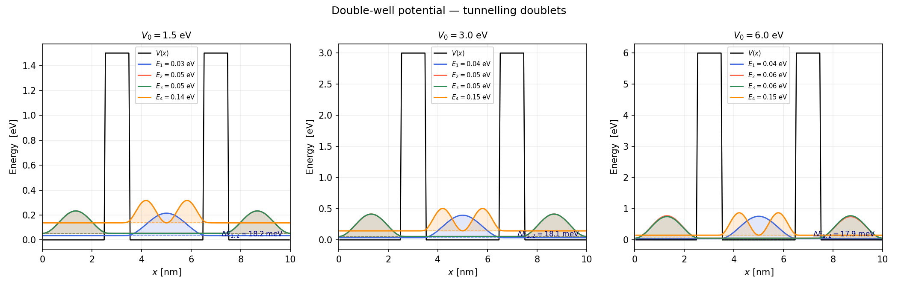
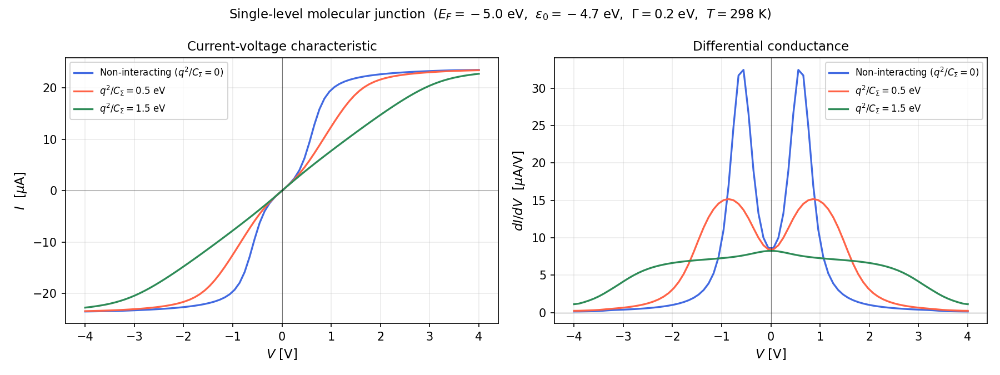
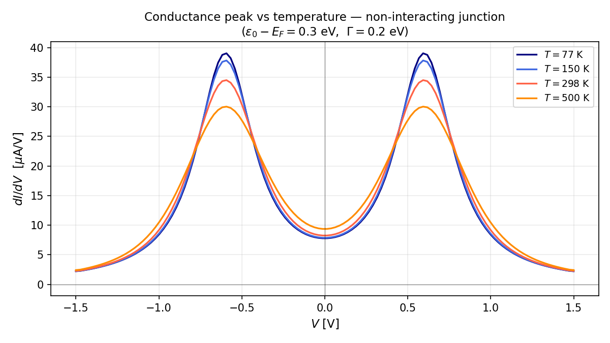
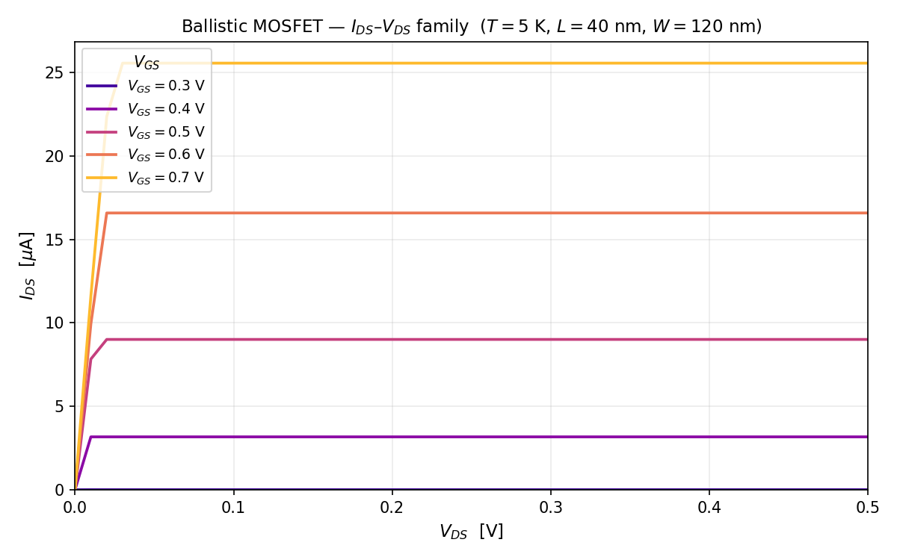
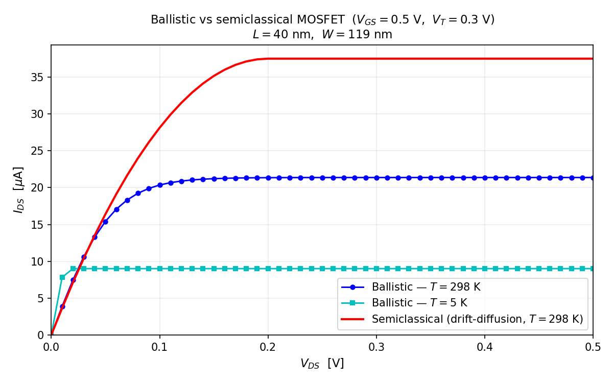

# Quantum Transport and Nanoelectronics

Python implementations of three core quantum transport problems from a nanoelectronics course, following Datta's *Quantum Transport: Atom to Transistor* framework.

---

## Repository layout

```
├── nanoelectronics/
│   ├── quantum1d.py   # 1D Schrödinger equation via finite differences
│   ├── transport.py   # Landauer-Büttiker molecular junction transport
│   └── mosfet.py      # Ballistic MOSFET with 2D electron gas
├── scripts/
│   ├── run_quantum1d.py   # Eigenstates + double-well tunnelling → 2 figures
│   ├── run_transport.py   # I-V and conductance → 2 figures
│   └── run_mosfet.py      # MOSFET I-V family + ballistic vs classical → 2 figures
└── figures/               # All PNG outputs
```

---

## Physics

### 1 — 1D Schrödinger equation

The time-independent Schrödinger equation

$$
\left[-\frac{\hbar^2}{2m}\frac{d^2}{dx^2} + V(x)\right]\psi_n = E_n\,\psi_n
$$

is discretized on a uniform grid with spacing $\Delta x = L/(N+1)$ (Dirichlet BCs $\psi(0)=\psi(L)=0$).  The Hamiltonian becomes the tridiagonal matrix

$$
H_{ij} = \left(2t_0 + V_i\right)\delta_{ij} - t_0\left(\delta_{i,j-1}+\delta_{i,j+1}\right), \qquad t_0 = \frac{\hbar^2}{2m\Delta x^2}
$$

Diagonalization gives the quantized energy levels and normalized wave functions.

**Analytical check (particle in a box):** $E_n = n^2\pi^2\hbar^2/(2mL^2)$.  With $N = 200$ grid points the numerical eigenvalues match the analytical values to better than $0.04\%$.

**Double-well potential:** Two rectangular barriers of height $V_0$ flanking a central well split every energy level into a tunnelling doublet.  The splitting $\Delta E_{1,2}$ decreases exponentially with $V_0$ — quantum mechanical tunnelling.

### 2 — Molecular junction quantum transport

A single molecular orbital (LUMO/HOMO) coupled symmetrically to source and drain electrodes (Datta's *toy model*, Ch. 2).

**Density of states:** Lorentzian (Breit-Wigner)

$$
D(E) = \frac{\Gamma/\pi}{(E - \varepsilon_0)^2 + (\Gamma/2)^2}, \qquad \Gamma = \Gamma_S + \Gamma_D
$$

**Current** (Landauer-Büttiker):

$$
I = \frac{q}{\tau_S + \tau_D}\int D(E - U)\bigl[f_S(E) - f_D(E)\bigr]\,dE
$$

where $\tau_{S,D} = \hbar/\Gamma_{S,D}$, $f_{S,D}$ are Fermi-Dirac distributions at the source/drain, and $U$ is a **self-consistent Hartree shift** (Coulomb blockade):

$$
U = \frac{q^2}{C_\Sigma}(N - N_0), \qquad N = \int D(E-U)\frac{\tau_D f_S + \tau_S f_D}{\tau_S + \tau_D}\,dE
$$

The fixed-point iteration (mixing factor 0.01) converges to the self-consistent occupation and gate shift.

**Parameters used:**  $E_F = -5.0$ eV, $\varepsilon_0 = -4.7$ eV, $\Gamma = 0.2$ eV, $T = 298$ K.

### 3 — Ballistic MOSFET (2D electron gas)

Channel with 2D electron gas above conduction band edge $E_C$.  The **ballistic** current formula (Lundstrom model):

$$
I_{DS} = I_0\sqrt{m}\int_{E_C+U}^{\infty}\sqrt{E - E_C - U}\,\bigl[f_S(E) - f_D(E)\bigr]\,dE
$$

$$
I_0 = \frac{qW}{\pi^2\hbar^2}, \qquad g_0 = \frac{mLW}{2\pi\hbar^2}\ \ \text{(2D DOS)}
$$

Self-consistent band shift from gate voltage and induced charge:

$$
U = -V_{GS}\frac{C_G}{C_\Sigma} - V_{DS}\frac{C_D}{C_\Sigma} + \frac{q(N - N_0)}{C_\Sigma}
$$

**Long-channel (semiclassical) model** for comparison:

$$
I_{DS} = \mu_n C_{OX}\frac{W}{L}\begin{cases}(V_{GS}-V_T)V_{DS} - \tfrac{1}{2}V_{DS}^2 & V_{DS} < V_{GS}-V_T \\ \tfrac{1}{2}(V_{GS}-V_T)^2 & V_{DS} \geq V_{GS}-V_T\end{cases}
$$

**Device:** $L = 40$ nm, $W = 120$ nm, $C_G = 0.1$ fF, $E_C - E_F = 0.3$ V (threshold voltage).

---

## Results

### 1D Schrödinger equation

| Particle in a box | Double-well — tunnelling doublets |
|:---:|:---:|
|  |  |

**Left:** First four eigenstates of a 10 nm box.  Probability densities $|\psi_n|^2$ are overlaid at their energy levels (dashed lines); the $n$-th state has $n-1$ nodes.  Numerical energies match the analytical formula $E_n = n^2\pi^2\hbar^2/(2mL^2)$ to $<0.04\%$.

**Right:** Symmetric double well for three barrier heights $V_0 = 1.5, 3.0, 6.0$ eV.  Each well-state splits into a doublet; the splitting $\Delta E_{1,2} \approx 18$ meV is controlled by tunnelling through the central barrier and is nearly independent of $V_0$ because the inter-barrier separation dominates.

---

### Molecular junction transport

| I-V: effect of Coulomb charging | Conductance vs temperature |
|:---:|:---:|
|  |  |

**Left:** The non-interacting ($q^2/C_\Sigma = 0$) junction shows a sharp sigmoid I-V centered on the level resonance.  Adding Coulomb charging ($q^2/C_\Sigma = 0.5, 1.5$ eV) **shifts** the resonance voltage and broadens/splits the conductance peak — the hallmark of single-electron Coulomb blockade.

**Right:** As temperature rises, the Fermi-Dirac distributions broaden, widening the conductance peak $dI/dV$.  At cryogenic temperatures ($T = 77$ K) the peak is sharper, enabling single-electron spectroscopy.

---

### Ballistic MOSFET

| $I_{DS}$–$V_{DS}$ family ($T = 5$ K) | Ballistic vs semiclassical ($V_{GS} = 0.5$ V) |
|:---:|:---:|
|  |  |

**Left:** At $T = 5$ K the Fermi-Dirac is essentially a step function: the current jumps immediately to its saturation value once $V_{DS} \gtrsim k_BT \approx 0.43$ meV, and depends strongly on $V_{GS}$ through the gate-induced band shift $U$.

**Right:** At $T = 298$ K, the ballistic model (21 μA) gives **lower** saturation current than the long-channel drift-diffusion formula (37.5 μA).  This counter-intuitive result reveals the breakdown of the classical model at the nanoscale: the long-channel formula assumes $L \gg \lambda_{mfp}$ (many scattering events), which drastically overestimates transport for a 40 nm device where carriers transit the channel without scattering.

---

## Usage

```bash
pip install numpy scipy matplotlib
```

```bash
python scripts/run_quantum1d.py
python scripts/run_transport.py
python scripts/run_mosfet.py
```

All scripts write PNG figures to `figures/` and print a summary to stdout.
